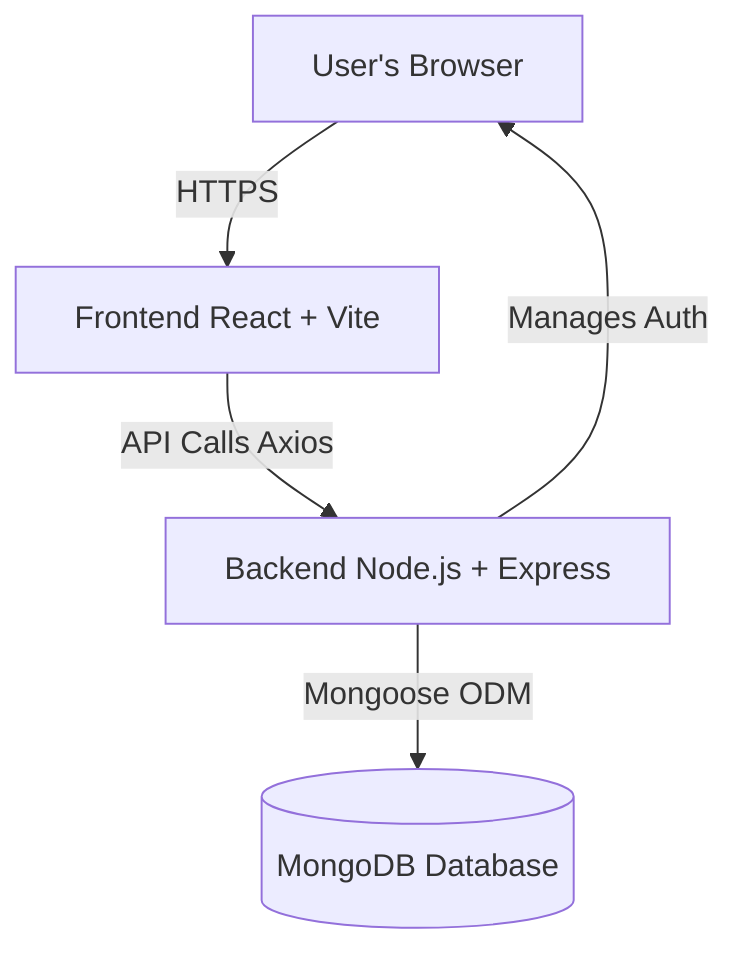
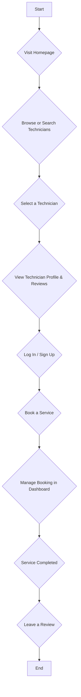

# T-Finder: On-Demand Technician Services

[](https://opensource.org/licenses/MIT)

T-Finder is a full-stack web application designed to connect users with skilled technicians for a variety of services. Users can browse technician profiles, read reviews, and book appointments seamlessly. The platform provides a robust dashboard for both users and technicians to manage their activities.


## 🚀 Key Features

- **User Authentication**: Secure JWT-based authentication for users and technicians.
- **Technician Discovery**: Search and filter technicians by specialty, location, and ratings.
- **Detailed Profiles**: View comprehensive technician profiles with skills, experience, and user reviews.
- **Booking System**: Easy-to-use booking functionality for scheduling services.
- **Review and Rating System**: Users can leave feedback and ratings for technicians.
- **Responsive Dashboard**: Separate dashboards for users and technicians to manage bookings, profiles, and reviews.
- **Mobile-First Design**: A fully responsive UI that works beautifully on all devices.
- **Server Information Popup**: Beautiful animated popup that informs users about the backend hosting on Render.com and provides guidance for server sleep issues.

## 🛠️ Tech Stack

### Frontend

| Technology | Description |
| :--- | :--- |
| **React** | A JavaScript library for building user interfaces. |
| **Vite** | A next-generation frontend tooling for fast development. |
| **React Router** | For declarative routing in the React application. |
| **Axios** | A promise-based HTTP client for making API requests. |
| **React Icons** | A library for including popular icons in the project. |
| **date-fns** | A modern JavaScript date utility library. |
| **Framer Motion**| A production-ready motion library for React. |
| **CSS3** | For styling and creating a responsive layout. |

### Backend

| Technology | Description |
| :--- | :--- |
| **Node.js** | A JavaScript runtime environment. |
| **Express.js** | A fast, unopinionated, minimalist web framework for Node.js. |
| **MongoDB** | A NoSQL database for storing application data. |
| **Mongoose** | An ODM library for MongoDB and Node.js. |
| **JWT** | JSON Web Tokens for secure user authentication. |
| **bcryptjs** | A library for hashing passwords. |
| **CORS** | Middleware for enabling Cross-Origin Resource Sharing. |
| **dotenv** | For managing environment variables. |

## 🏗️ Architecture Diagram

This diagram illustrates the high-level architecture of the T-Finder application.



## 🌊 User Flow

This flowchart shows a typical user journey, from finding a technician to booking a service.



## 🏁 Getting Started

To get a local copy up and running, follow these simple steps.

### Prerequisites

- Node.js (v18 or later)
- npm
- MongoDB (local instance or a cloud service like MongoDB Atlas)

### Installation & Setup

1. **Clone the repository:**
   ```sh
   git clone https://github.com/pentoshi007/t-finder.git
   cd t-finder
   ```

2. **Setup the Backend:**
   ```sh
   cd server
   npm install
   ```
   - Create a `.env` file in the `server` directory and add the following variables:
     ```
     MONGO_URI=your_mongodb_connection_string
     JWT_SECRET=your_jwt_secret
     PORT=3001
     ```
   - Start the backend server:
     ```sh
     npm run dev
     ```

3. **Setup the Frontend:**
   - In a new terminal, navigate to the `client` directory:
     ```sh
     cd client
     npm install
     ```
   - Create a `.env` file in the `client` directory and add the backend API URL:
     ```
     VITE_API_BASE_URL=http://localhost:3001
     ```
   - Start the frontend development server:
     ```sh
     npm run dev
     ```

Your application should now be running locally!
- Frontend: `http://localhost:5173` (or another port if 5173 is busy)
- Backend: `http://localhost:3001`

## 📂 API Endpoints

A summary of the main API routes available:

| Method | Endpoint | Description |
| :--- | :--- | :--- |
| `POST` | `/api/auth/register` | Register a new user. |
| `POST` | `/api/auth/login` | Log in a user. |
| `GET` | `/api/technicians` | Get all technicians. |
| `GET` | `/api/technicians/:id` | Get a single technician. |
| `GET` | `/api/technicians/:id/reviews` | Get reviews for a technician. |
| `POST` | `/api/reviews` | Create a new review. |
| `GET` | `/api/bookings` | Get all bookings for a user. |
| `POST` | `/api/bookings` | Create a new booking. |

T-Finder is a modern web application built with the MERN stack that allows users to find and review local technicians for a variety of services.

## Features

- Search for technicians by service category and city.
- View detailed technician profiles with ratings and reviews.
- Modern, responsive, and glassmorphic user interface.

## Tech Stack

- **Frontend:** React, Vite, Axios, React Router
- **Backend:** Node.js, Express.js
- **Database:** MongoDB, Mongoose

## Getting Started

*Instructions for setting up and running the project will be added here as the project progresses.*
